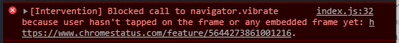

## Simple implementation of Vibration Web API

Vibration Web API is the API to control vibration of the device. Currently (May 18th 2021), this API is not supported on IOS devices. Although, device supports the API but does not have vibration mechanism, then also it does not work.

[DemoLink](https://shreekrishnalamichhane.github.io/Vibration-Web-API-with-JS/)

Thats being said, lets see what we have done here,

First, its a good idea to check if the device supports the API or not by doing.
```js
// Check if the device supports the Vibration API
const support = Boolean(window.navigator.vibrate);
```

This will set the value of support to true or false depending upon whether the device supports the vibration API or not. Since we have the status, now we can display the status if we want like,

```js
if(support){
    console.log('Vibration API is supported.');
    //Any other logics.
}
else{
    console.error('Vibration API is not supported.');
    //Any other logics.
}
```

Here's the simple html code with a button to trigger the vibration.
> Note: Modern browsers do not trigger the events on pageload until first user action on the page.



so we are using a button to trigger an event here.

Here's the html

```html
<body>
    <button id="btn">Vibrate</button>
</body>
```

Lets grab that button with id `btn` from js.
```js
const btn = document.queryselector('#btn');
if(support){
    btn.addEventListener('click',()=>{
        //Your vibration logic.
    });
}
```

Now for vibration logic, window.navigator.vibrate method is responsible with accepts an array with multiple values.

> - ###### For static vibration
> if we provide single valued array, then it will vibrate for provided interval and then stops.
> ```js
>    window.navigator.vibrate([500]);
>```
> In this example, device will vibrate for 500ms and then stops.

> - ###### For vibration pattern
> We can also provide multiple values to the array such that starting with 0, even indices are the time for vibration and odd index are for interval between vibration.
> ```js
>    window.navigator.vibrate([500,250,500,250,500]);
>```
> In this example, device will vibrate for 500ms waits 250ms , again vibrates 500ms and waits 250ms and so on. 

This flexibility allows us to program different vibration patterns. Here are some sample vibration patterns.

```js
//Older Iphone Vibration pattern.
window.navigator.vibrate([1000,1000,1000,1000,1000,1000,1000,1000,1000,1000,1000]);

//Legacy samsung phone's vibration pattern.
window.navigator.vibrate([250,250,250,250,250,800,250,250,250,250,250,250]);

// Morse code for SOS
window.navigator.vibrate([100,30,100,30,100,30,200,30,200,30,200,30,100,30,100,30,100]);
```

> - ###### Stop the Vibration
> To stop the vibration for any reason, we can pass an empty array to the method and the vibration will stop.
> ```js
> window.navigator.vibrate([]);
>```


That's it. 
Happy coding.

